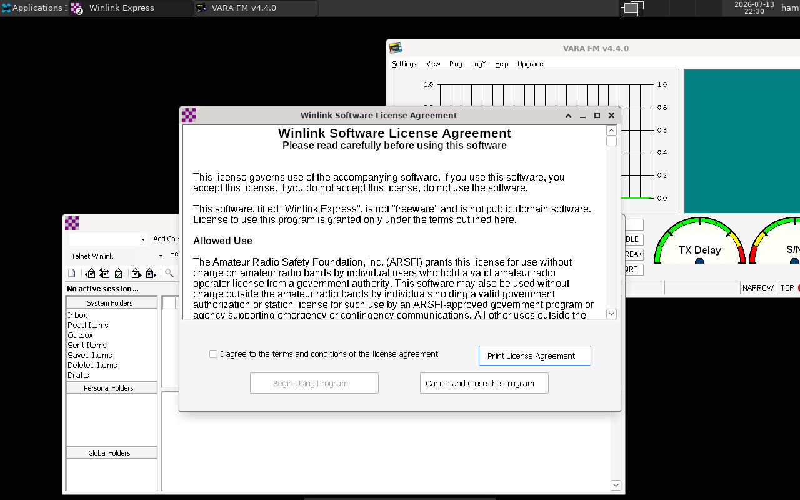

# Docker WinLink 📻

An amateur-radio desktop in a container. One command gives you a full Linux
desktop — in your web browser — with **Winlink Express**, **VARA FM/HF**,
**Dire Wolf**, and **CHIRP** already installed and configured. No Linux or
Docker experience needed. Runs on **Windows, macOS, and Linux**.



<p align="center"><em>Winlink Express and VARA FM running under Wine on the
containerized desktop — viewed in a web browser.</em></p>

> 📡 You need an amateur radio license to transmit. Winlink's telnet mode and
> everything else here work for practice with no radio and no license.

## Get started

**1. Install [Docker Desktop](https://www.docker.com/products/docker-desktop/)**
(Linux: Docker Engine + Compose plugin) and start it.

**2. Get the files** — download the ZIP from GitHub and unzip, or:

```bash
git clone https://github.com/leavesofgrass/docker-winlink docker-winlink
cd docker-winlink
```

**3. Set your passwords** — copy the example config and edit the two passwords:

```bash
cp .env.example .env        # macOS / Linux
```
```powershell
Copy-Item .env.example .env # Windows PowerShell
```

**4. Build and start** (same command everywhere):

```bash
docker compose up -d --build
```

The **first build takes 20–30 minutes** — it downloads and sets everything up.
You only wait once. Watch it with `docker compose logs -f` (Ctrl+C stops
watching, not the container).

**5. Open the desktop** → **<http://localhost:6080/vnc.html>**, click
**Connect**, enter your `VNC_PASSWORD`.

**6. Launch an app** → **Applications → Ham Radio → Winlink Express** (or VARA).

That's it. 🎉

## Try it with no radio

Open **Winlink Express**, enter a callsign, and start a **Telnet Winlink**
session — it sends real Winlink email over the internet, no radio required. Best
first test that everything works. When ready for the air, see
**[docs/radios.md](docs/radios.md)**.

## Everyday commands

```bash
docker compose up -d          # start
docker compose stop           # stop (keeps your data)
docker compose logs -f        # watch output
docker compose down           # stop + remove container (data kept)
```

Your messages, VARA registration, and settings live in a Docker volume and
survive stops, restarts, and rebuilds.

## Rebuilding

Rebuild after editing the `Dockerfile`, or to pull newer packages:

```bash
docker compose up -d --build            # rebuild changed layers, then restart
docker compose build --no-cache         # full clean rebuild from scratch
docker compose down && docker compose up -d --build   # rebuild + recreate
```

Rebuilds reuse cached layers, so they're much faster than the first build unless
the Arch base image refreshed. Your data volume is untouched by a rebuild.

## Documentation

Keep it simple to start; reach for these when you need them:

- **[docs/radios.md](docs/radios.md)** — connecting USB radios (CAT, packet, CHIRP)
- **[docs/audio.md](docs/audio.md)** — getting sound working per platform
- **[docs/configuration.md](docs/configuration.md)** — `.env` settings, ports, SSH, references
- **[docs/troubleshooting.md](docs/troubleshooting.md)** — common issues

## Contributing

Improvements are very welcome — especially reports of what worked (or didn't)
with your radio and host OS. See **[CONTRIBUTING.md](CONTRIBUTING.md)**. If this
was useful, a ⭐ helps others find it.

## License

This project — the Dockerfile, scripts, and documentation — is licensed under
the **GNU General Public License v2.0** ([LICENSE](LICENSE)).
Copyright © 2026 Jon Pielaet (KD7SWH).

It does **not** redistribute Winlink Express or VARA — the image downloads those
from their official sites when you build. Winlink Express is free for licensed
hams; VARA (EA5HVK) is shareware that runs speed-limited until you buy a key.
Dire Wolf, CHIRP, and hamlib are open-source. You are responsible for holding
the proper license to transmit and following your local regulations.

---

*73!* Built on Arch Linux + XFCE + Wine.
